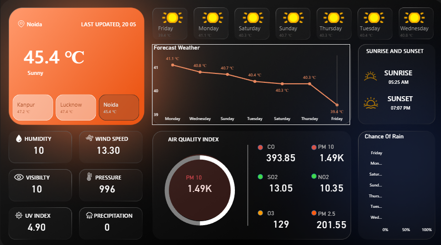

# 🌦️ Real-Time Weather Analytics Dashboard

## 📌 Project Overview
This project is a Weather Analytics Dashboard created using real-time weather data collected from a Weather API for three cities:

- Lucknow
- Kanpur
- Noida

The data was cleaned, transformed, and visualized in Power BI to generate meaningful weather insights and interactive dashboards.

---

## 🚀 Tools & Technologies Used

- Power BI
- Weather API
- Power Query
- Data Cleaning
- Data Visualization
- Excel / CSV
- DAX

---

## 📊 Dashboard Features

✔ Real-time weather data visualization  
✔ City-wise weather comparison  
✔ Temperature analysis  
✔ Humidity tracking  
✔ Weather condition insights  
✔ Interactive filters and visuals  
✔ Clean and modern dashboard design

---

## 🛠️ Project Workflow

### 1️⃣ Data Collection
- Extracted weather data using Weather API.
- Collected data for Lucknow, Kanpur, and Noida.

### 2️⃣ Data Cleaning
- Removed null values
- Fixed data types
- Organized columns
- Cleaned and transformed data using Power Query

### 3️⃣ Data Visualization
Created interactive Power BI dashboard including:
- KPI Cards
- Bar Charts
- Line Charts
- Weather Comparisons
- Slicers & Filters

---

## 📷 Dashboard Preview

---

## 📈 Key Insights

- Compared temperature trends across cities
- Identified humidity differences
- Tracked weather conditions in real time
- Created easy-to-understand visual reports

---

## 📂 Project Files

- Power BI Dashboard (.pbix)
- Cleaned Dataset
- Dashboard Screenshots
- README.md

---

## 🎯 Objective

The objective of this project is to demonstrate:
- API data extraction
- Data cleaning skills
- Data visualization skills
- Power BI dashboard creation
- Analytical thinking

---

## 👨‍💻 Author

Kushagra

Aspiring Data Analyst passionate about data visualization, SQL, Power BI, and analytics.

---

## ⭐ If you like this project, feel free to give it a star!
